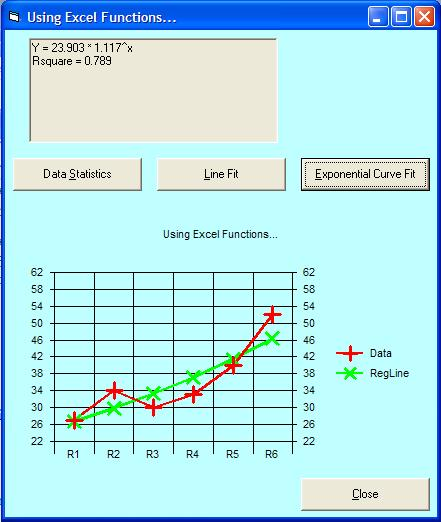



## Using Excel Functions from VB

### Description

Excel exposes many powerful functions that can also be used in VB. This program demonstartes how to use several by passing data arrays to the functions. Some of the Excel functions return multidimensional arrays and this program shows how to retrieve the returned information.
 
### More Info
 
You must have Excel on your machine. I use Excel 2002 so I don't know how this program works with other versions.

             |
---                |---
**Submitted On**   |2005-03-12 17:21:04
**By**             |[G\. Hennen](https://github.com/Planet-Source-Code/PSCIndex/blob/master/ByAuthor/g-hennen.md)
**Level**          |Advanced
**User Rating**    |4.7 (14 globes from 3 users)
**Compatibility**  |VB 6\.0
**Category**       |[VB function enhancement](https://github.com/Planet-Source-Code/PSCIndex/blob/master/ByCategory/vb-function-enhancement__1-25.md)
**World**          |[Visual Basic](https://github.com/Planet-Source-Code/PSCIndex/blob/master/ByWorld/visual-basic.md)
**Archive File**   |[Using\_Exce1864033132005\.zip](https://github.com/Planet-Source-Code/g-hennen-using-excel-functions-from-vb__1-59453/archive/master.zip)

